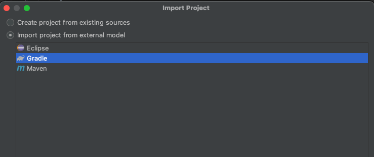

# Foodmarket
Understand food products, their ingredients and allergens.

Food-market is a webapp developed to help people make informed decisions about their food choices. We collect raw data 
from FDA and similar public sources, process and transform the raw data into valuable insights that the users can 
consume. 

# Architecture 

# Database setup

# Build 
The backend application is developed using Java with [SpringBoot](https://spring.io/projects/spring-boot) and uses [Gradle](https://docs.gradle.org/current/userguide/userguide.html) 
as a build tool. Following are the steps to setup the application locally: 
1. Clone the source code
   1. `git clone git@github.com:abhishektiwari98/foodmarket.git`
   2. Make sure git is installed and configured. Instructions [here](https://git-scm.com/book/en/v2/Getting-Started-Installing-Git). 
2. Run local build
   1. This requires Gradle setup. Instructions [here](https://gradle.org/install/)
   2. Run build with `./gradlew clean build` from foodmarket directory.
3. Import project in IntelliJ
   1. IntelliJ is an excellent IDE for Java based applications. 
   2. Go to File -> New -> Project from existing sources and select the foodmarket directory.
   3. Import and select Gradle in the next window (as shown in the image)  
      
4. Run the backend by
   1. You can run `FoodmarketApplication` directly from IntelliJ
   2. You can also launch it with gradle as `./gradlew bootRun`
5. 

# Deployment 
TBD

